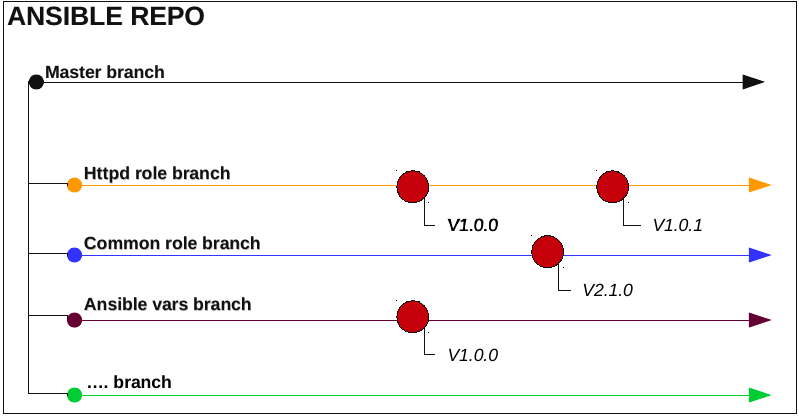

# ANSIBLE VERSIONING

## Why versioning is important?  

* While developing role you can be sure that old version is available and your changes are not affecting production version of role. So you will not break production  
* In case of trouble you can quickly install old version. Which reduce possible downtime.  
* You can use different version prod env and stage and so on.
* Consistency and compatibility. Your role depends on other roles. If somebody change the role you depend on it can break something in your code.  
  
## What do you need to know about this solution?  
  
* To behave like normal repo with roles and playbooks, branches are used. Sometimes you can not create as many repos as you want but you can create as many branches as you need.  
  
* Every potentially releasable version must be tagged. This is the key and most important moment.  
* We need to know how ansible-galaxy works  

## Creating new role version  

We have changed role and commit changes we must create new tag for this version. 
```
git push origin role_branch
git tag role_name-vX.Y.Z
git push origin role_name-vX.Y.Z
```
Current versions list: `git tag`  
  
## Prepare playbook for execution in local environment

`vagrant up`

For example we want to execute http playbook. The role depends on `common` and `sshd` roles.  
```
#git tag
ansible_vars-v1.0.0
common-v1.0.0
common-v1.0.1
httpd-v1.0.0
sshd-v1.0.0

```
Checkout to httpd role:  
```
cd /root/ansible-versioning
git checkout httpd-v1.0.0
```
Download ansible variables:  
```
git clone https://github.com/pymag09/ansible-versioning.git hosts
cd hosts
git checkout ansible_vars-v1.0.0
```
Use python virtual environment:
```
workon ansible-2.2.2
```
Download dependencies:  
```
# ansible-galaxy install -r requirements.yaml -p .
- extracting common to ./common
- common was installed successfully
- extracting sshd to ./sshd
- sshd was installed successfully
```
Execute playbook:  
```
ansible-playbook -i hosts/localhost playbook.yml 
```
After that try to change version `version: common-v1.0.1` in requirements.yaml and run ansible-galaxy install --force -r requirements.yaml -p . one more time.  
  
In multi tenant environment the process might be following:  
```
tmpdir=$(mktemp -d)
cd $tmpdir
git clone https://github.com/pymag09/ansible-versioning.git
cd ansible-versioning
git clone https://github.com/pymag09/ansible-versioning.git hosts
cd hosts
git checkout ansible_vars-v1.0.0
cd ..
git checkout httpd-v1.0.0
workon ansible-2.2.2
ansible-galaxy install -r requirements.yaml -p .
ansible-playbook -i "localhost," playbook.yml 
rm -fR $tmpdir
```
or ansible playbook can be executed inside docker container which will be killed after execution